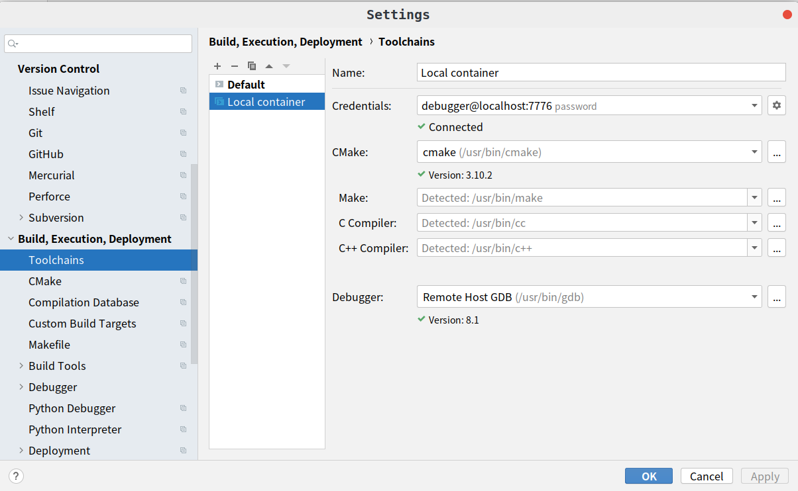
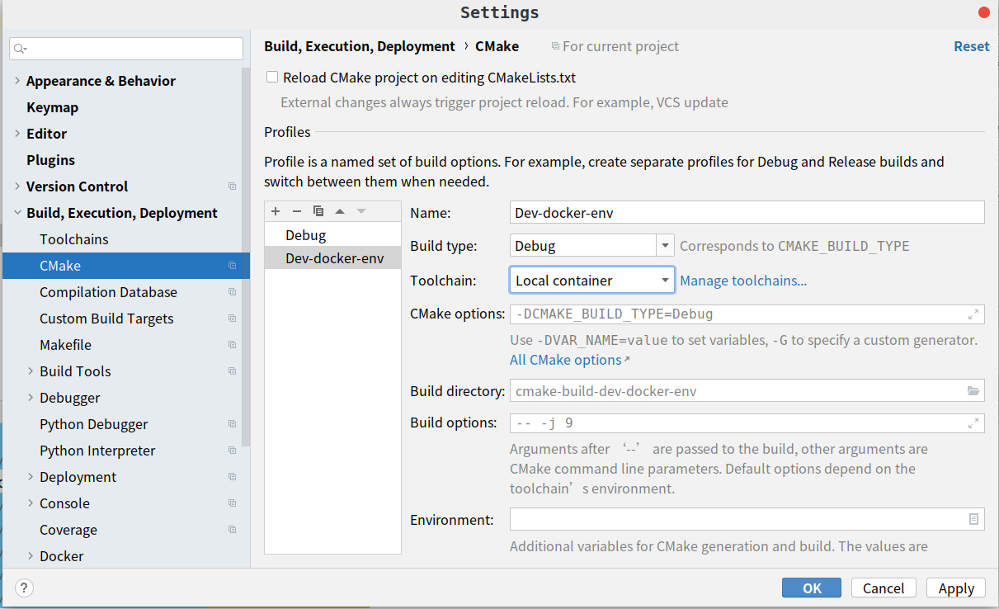
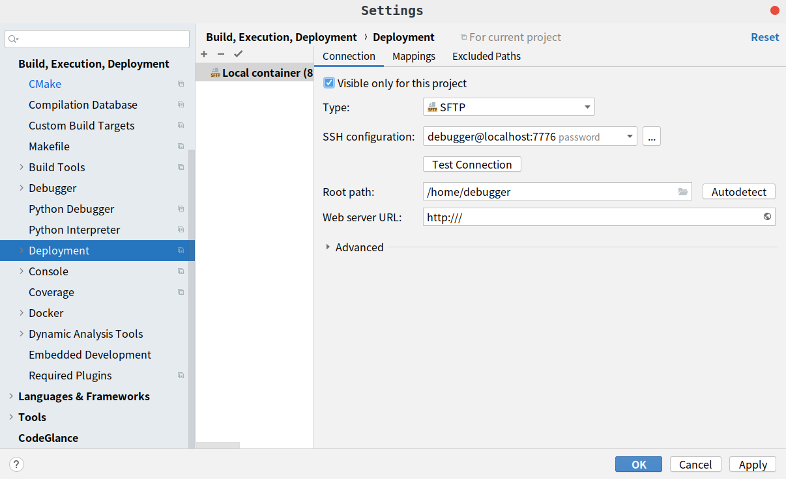

# Docker CLion 开发环境搭建

- [配置参考](https://github.com/shuhaoliu/docker-clion-dev)
- [Docker构建](https://docs.docker.com/develop/develop-images/dockerfile_best-practices/)
- [使用 Clion 调试 Docker](https://zjuturtle.com/2019/04/29/clion-docker/)

##用法

1. 构建镜像

    `docker build -t clion_docker:dev .`
    
2. 后台起ssh容器

    `docker-compose up -d`
    
3. 通过debugger用户登入容器

    `ssh debugger@localhost -p 7776`
    
    `exit`

4. 配置CLion Docker工具链环境

    
    
5. 项目配置
    
    

6. 部署配置
    
    
    